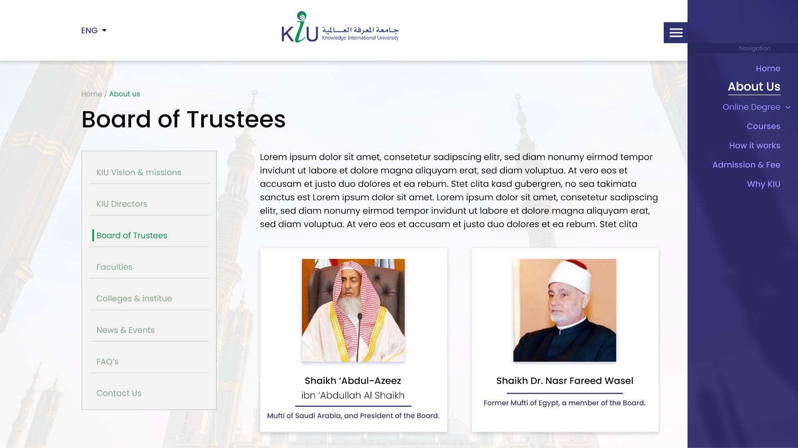
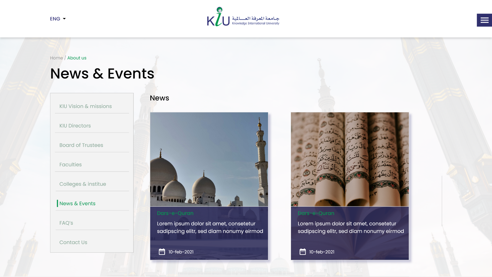
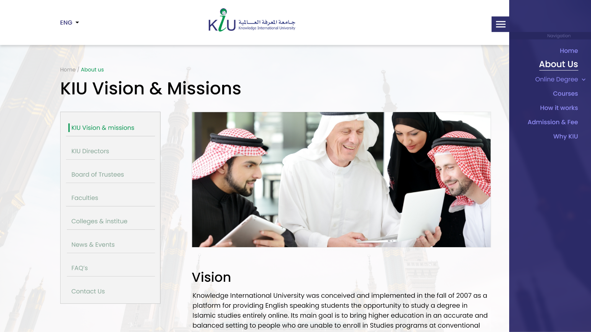

# kiu-sis-lms-

INTRODUCTION

Knowledge International University is a platform for providing Islamic education in different languages (English, Urdu, Arabic, and French) to International students around the world. JMM acts as the IT consultant for KIU to develop SIS and other integrated systems like to manage the whole processes from student admissions to their graduation.

SYSTEM FEATURES

1. Educational Curriculum Management
2. Students Academic Records
3. Students Admission Management
4. Students Online Sessions Management
5. Grading Engine
6. Finance Management
7. Scholarships
8. Analytics & Reporting 

TECNICALITIES/TOOLS USED

1. ASP .NET
2. ReactJS
3. Moodle
4. Blackboard SDK
5. Flutter
6. Dart
7. FCM
8. SMS Gateway

SYSTEM SCREENSHOTS

 

SYSTEM LINK

Admin Portal: https://ar.kiu.org/sis/admin/login

Student Portal: https://ar.kiu.org/sis/student/login

Finance Portal: https://finance.kiu.org/

Executive Portal: https://executive.kiu.org/
